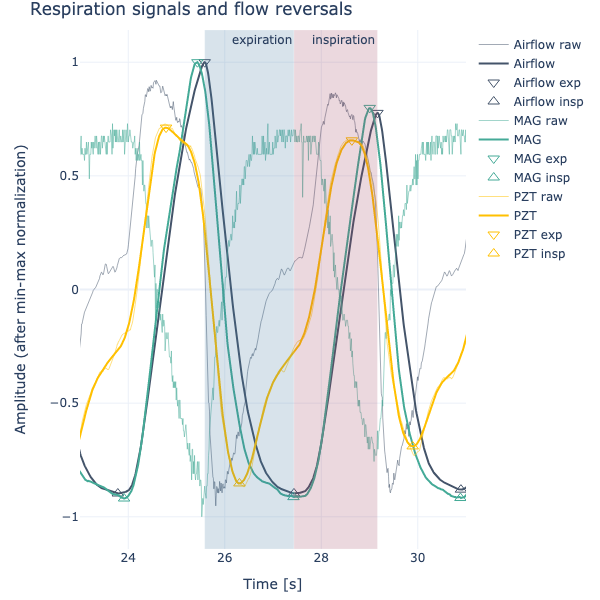
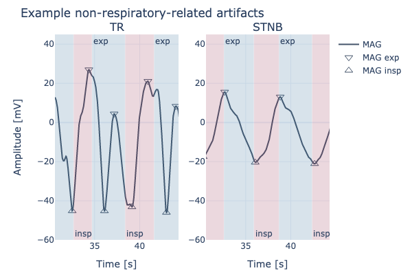

# Data Analysis on Respiratory Data

## Validation of a prototype

After proposing a novel methodology for respiration monitoring (based on magnetic field variations), I had to validate it against an analogous commercially available sensor (piezoelectric, PZT, sensor), using a gold-standard (airflow transducer) as reference.

A set of 12 different activities were performed by 16 healthy subjects, simultaneously wearing the 3 sensors.

## What we are trying to understand?

For the context of monitoring respiratory patterns, at this stage it would be enough to test the performance of the prototype in the representation of flow reversal (FR) events, aka the onset of **inspiration** and **expiration**. To characterize the prototype the main objectives were to answer the following questions:

**Q1:** What is the accuracy of detection of FR events and key respiratory measures in comparison to the PZT sensor?
**Q2:** Does the prototype have differential performance under different activities?
**Q3:** Can we use the prototype to compute key respiratory metrics?

## Exploring data

#### Q1. FR detection

In order to characterize the performance of my prototype in regard to its representation of the respiratory patterns, I started by developing an algorithm for detection of FR events peak and valley detection. The algorithm is based on **peak-valley detection** and on empirical criteria, such as the minimum distance between extrema, extremum prominence, and peak-valley amplitude.

It may help to understand the task of FR detection by seeing waveforms, where **peaks = onset expiration** and **valleys = onset inspiration**:

To characterize performance of FR detection, I used three metrics: **ratio** (which evaluates the ratio between _detected_ FR events and the _actual_ FR events), precision, and recall. I also used the **Wilcoxon signed-rank test** to compare performance between my prototype and the PZT sensor.

Overall, the prototype **outperformed** the PZT (p<0.001), with larger values of mean precision and recall.

#### Q2. Performance according to activities

The performance metrics startified by activity showed an increased performance of the prototype in activities that are characterized by either lack of non-respiratory motion or movements that do not rely heavily on torso mobility.

The performance decreased in activities that imply a severe alteration of torso posture, like a side stretch (but still performed slightly better than the PZT in these cases!). The image below illustrates what happens to the prototype signal when performing a torso rotation when compared to a standing respiration.

#### Q3. Respiratory metrics

From the FR events, I computed key respiratory measures: inspiration time (tI), expiration time (tE), and breath cycle time (tB). To get an estimate of agreement between the sensors and the reference (airflow transducer), I used **linear regression analysis**.

This analysis revealed a large agreement between all metrics, in particular for tI and tB, which had slopes very close to unity and intercepts close to zero:

|     |  Sensor   | Slope | Intercept |
| :-: | :-------: | :---: | :-------: |
| tI  | Prototype | 1.01  |   -0.01   |
| tI  |    PZT    | 0.92  |   0.19    |
| tE  | Prototype | 0.95  |   0.10    |
| tE  |    PZT    | 0.92  |   0.18    |
| tB  | Prototype | 0.99  |   0.03    |
| tB  |    PZT    | 0.97  |   0.15    |

## Final insights

Overall, the prototype has shown comparable performances to a commercially-available analogous sensor, and in some circumstances even surpassing it. Despite adequate performance in a majority of contexts, care is advised when activities that imply significant torso mobility is required.

### Other info

Scientific paper available at: https://doi.org/10.1109/TBME.2024.3367536
